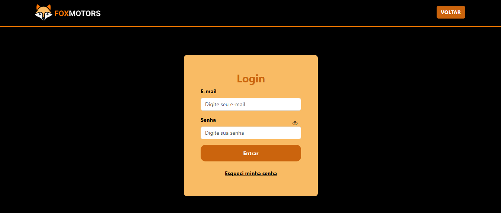
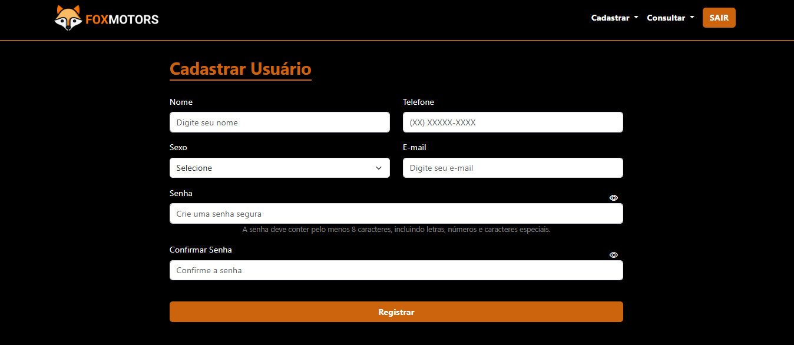
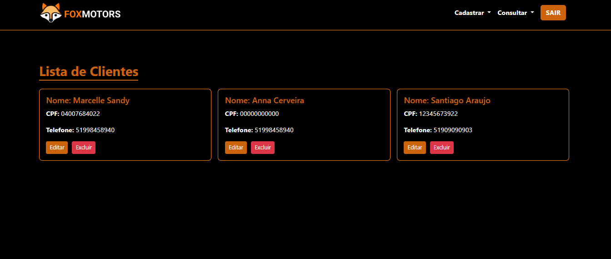

# 🚗 **FoxMotors - Sistema de Revenda de Veículos**  


O **FoxMotors** é um sistema desenvolvido para facilitar a gestão de revendas de veículos, oferecendo funcionalidades modernas para controle de clientes, veículos e vendas. Além disso, permite o gerenciamento do portfólio de veiculos, trazendo praticidade e eficiência para o seu negócio.

---

## 🎨 **Links Importantes**

- 🔗 Acesse o Sistema: [Acesse o FoxMotors](https://marcellesandy.com.br/)
Para acessar o sistema use as informações abaixo.
Usuário: teste@teste.com
Senha: Teste12.
- 📚 Documentação do Branding: [Acesse o Branding](https://www.canva.com/design/DAGYBrknxbw/3MKnkPnVkDES1QNTOX16WA/edit?utm_content=DAGYBrknxbw&utm_campaign=designshare&utm_medium=link2&utm_source=sharebutton)
- 🎨 Protótipo no Figma: [Acesse o Figma](https://www.figma.com/design/GhBeXSgSrp2Caz9nblTMbq/Untitled?node-id=0-1&t=Ix4xWTYN7kSvDudA-1)

---

## 🎯 **Objetivo do Projeto**  

O objetivo do **FoxMotors** é fornecer uma plataforma simples, intuitiva e completa para a administração de revendas de veículos. Focado na produtividade, o sistema permite:  

- 🚀 **Cadastro e gerenciamento** de clientes, veículos e vendas.  
- 🔍 **Consultas dinâmicas** para facilitar o acesso às informações.  
- 📍 **Busca automática de endereços** utilizando o **ViaCEP** com base no CEP.  
- 📧 **Envio de e-mails** através do serviço **getFORM**, garantindo comunicação eficiente com os usuários.  

---

## 🛠️ **Tecnologias Utilizadas**  

As principais tecnologias utilizadas no desenvolvimento são:  

- **PHP 8.x** - Back-end para lógica do sistema e integração com o banco de dados.  
- **MySQL** - Banco de dados utilizado para armazenamento eficiente das informações.  
- **HTML5 / CSS3** - Estrutura e estilização responsiva da interface.  
- **JavaScript** - Recursos dinâmicos para interatividade do usuário.  
- **Bootstrap 5.3** - Framework para design moderno e responsivo.  
- **ViaCEP** - API gratuita para localização automática de endereços com base no CEP informado.  
- **getFORM** - Ferramenta de envio de e-mails segura e rápida para recuperação de senhas e notificações.  

---

## ⚙️ **Funcionalidades**  

O **FoxMotors** possui diversas funcionalidades que simplificam as operações diárias de uma revenda de veículos:  

### **1. Gerenciamento de Clientes**  
- 📋 Cadastro completo de clientes (nome, CPF, telefone, etc.).  
- 🔍 Consulta e edição de dados dos clientes.  
- 🗑️ Exclusão de clientes (com verificação de vínculos em vendas).  

### **2. Gerenciamento de Veículos**  
- 🚘 Cadastro de veículos com informações detalhadas (modelo, marca, ano, cor, preço).  
- 📸 Upload de imagens dos veículos.  
- 🔄 Atualização e consulta dos veículos disponíveis.  

### **3. Gerenciamento de Vendas**  
- 📝 Registro das vendas, associando clientes e veículos vendidos.  
- 📊 Cálculo automático do valor final da venda com descontos aplicados.  
- 🗒️ Consulta e edição de registros de vendas.  

### **4. Gerenciamento de usuários**  
- 📋 Cadastro completo de usuários (nome, e-mail, senha, etc.).  
- 🔍 Consulta e edição de dados dos usuários.  
- 📍 Busca automática de endereço ao informar o CEP (utilizando **ViaCEP**).  
- 🗑️ Exclusão de usuários (com verificação de vínculos em vendas).  

### **5. Autenticação de Usuários e E-mails**  
- 🔐 Login seguro com sistema de autenticação.   
- 🛑 Proteção de rotas administrativas contra acessos não autorizados.  

---

## 📁 **Estrutura do Projeto**  

A estrutura do sistema está organizada de forma modular para facilitar o desenvolvimento e manutenção:  

```plaintext
ProjetoFinal_MarcelleSandy/
│
├── config/                # Configuração do banco de dados
│   └── config.php
│
├── classes/               # Classes PHP responsáveis pela lógica do sistema
│   ├── Cliente.php
│   ├── Veiculo.php
│   ├── Venda.php
│   └── Usuario.php
│
├── imagens/               # Pasta para armazenar as imagens do sistema
│
├── uploads/               # Pasta para armazenar as imagens do sistema
│
├──.gitattributes                # Configurações de atributos do Git
├──atualizarVeiculo.php          # Atualiza informações dos veículos
├──cadastrarCliente.php          # Página para cadastro de clientes
├──cadastrarUsuario.php          # Página para cadastro de usuários
├──cadastrarVeiculo.php          # Página para cadastro de veículos
├──cadastrarVenda.php            # Página para cadastro de vendas
├──consultarCliente.php          # Página para consulta de clientes
├──consultarUsuario.php          # Página para consulta de usuários
├──consultarVeiculo.php          # Página para consulta de veículos
├──consultarVendas.php           # Página para consulta de vendas
├──deletarCliente.php            # Deleta registros de clientes
├──deletarUsuario.php            # Deleta registros de usuários
├──deletarVeiculo.php            # Deleta registros de veículos
├──deletarVenda.php              # Deleta registros de vendas
├──editarCliente.php             # Edita informações dos clientes
├──editarUsuario.php             # Edita informações dos usuários
├──editarVeiculo.php             # Edita informações dos veículos
├──editarVenda.php               # Edita registros de vendas
├──enviarEmail.php               # Envio de e-mails (integração com getFORM)
├──form.php                      # Página de formulário
├──index.php                     # Página inicial do sistema
├──login.php                     # Página de login do sistema
├──logout.php                    # Encerra a sessão do usuário
├──portal.php                    # Painel principal do sistema
├──README.md                     # Documentação principal do projeto
````
---

## 💡 Melhorias Futuras

- **🔒 Sistema de Permissões**: Implementar níveis de acesso (administrador, gerente, funcionário).
- **📊 Relatórios Gerenciais**: Geração de gráficos e relatórios financeiros sobre vendas.
- **🖼️ Otimização de Imagens**: Redimensionamento automático de imagens no upload.

---

## 😎 Instalação e Uso

### **Pré-requisitos**

Antes de iniciar, certifique-se de ter instalado:

- **PHP 8.x**
- **MySQL**

---

### 🚀 **Passo a Passo**

1. **Clone o repositório**:

   ```bash
   git clone https://github.com/marcellenevessandy/ProjetoFinal_MarcelleSandy.git
   cd foxmotors

2. **Configure o banco de dados**:

   - **Importe** o arquivo `database.sql` no **MySQL**.

   - **Edite** o arquivo de configuração do banco de dados:
     Abra o arquivo `config/config.php` e ajuste as credenciais conforme o seu ambiente:

     ```php
     <?php
     define('DB_HOST', 'localhost'); // Host do banco de dados
     define('DB_NAME', 'nome_do_banco'); // Nome do banco de dados
     define('DB_USER', 'usuario'); // Usuário do banco
     define('DB_PASS', 'senha'); // Senha do banco
     ?>
     ```
3. **Inicie o servidor**:

   Se estiver utilizando o servidor nativo do **PHP**, execute o seguinte comando no terminal:

   ```bash
   php -S localhost:8000

4. **Acesse ao navegador**:
http://localhost:8000

---

### 🎨 **Capturas de Tela**
Tela de Login


Cadastro de Usuário


Consulta de Clientes


Veículos Disponíveis


---

### 👤 **Autora**
Desenvolvido com 💖 por Marcelle Neves Sandy.

E-mail: marcellesandy3@gmail.com
